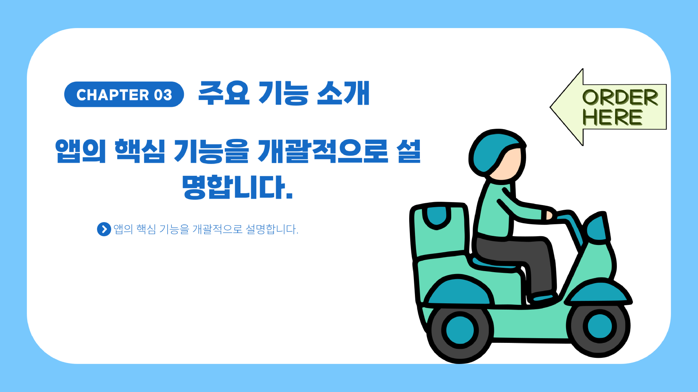

# 🏍️ 배달 앱 프로젝트

이 프로젝트는 다양한 최신 웹 기술과 서버 기술을 활용하여 개발된 **배달 서비스 앱**입니다.  
사용자는 간편하게 로그인하고, 실시간 채팅을 이용하며, 지도에서 위치 기반 서비스를 활용할 수 있습니다.  

---

## 📌 주요 기술 스택

### 🔐 **카카오 API를 통한 로그인 기능**
- 카카오 계정을 사용하여 간편하게 로그인할 수 있습니다.

### ☁️ **GOOGLE CLOUD**
- 서버 운영을 위해 **Google Cloud** 플랫폼을 사용하여 확장성 및 보안성을 강화하였습니다.

### 🗺️ **구글 지도 (Google Maps)**
- 위치 기반 서비스를 제공하기 위해 **Google Maps API**를 활용하여, 실시간 지도 정보를 확인하고 원하는 위치에 마커를 생성할 수 있습니다.

### 🔥 **Firebase**
- 실시간 채팅 기능을 구현하기 위해 **Firebase**의 실시간 데이터베이스를 사용하여 **사용자 간 실시간 소통**을 지원합니다.

### 🛢️ **MySQL 및 Node.js**
- MySQL을 데이터베이스로 활용하고, Node.js를 서버 사이드 프로그래밍 언어로 채택하여 **안드로이드 앱과의 효율적인 데이터 통신**을 구현하였습니다.

---

## 🌐 웹 사용 기술 스택

### 🎨 **Vanilla JS**
- 프레임워크나 라이브러리 없이 **순수 JavaScript**만으로 웹 페이지의 동적 기능을 구현합니다.

### 💻 **JQuery**
- **DOM 조작, 이벤트 핸들링, 애니메이션 기능**을 간편하게 수행하여 개발 속도를 높이고, **사용자 인터렉션을 쉽게 구현**할 수 있습니다.

### 🎨 **Bootstrap**
- 반응형 웹 디자인을 위해 **Bootstrap 프레임워크**를 활용하여, **다양한 디바이스 크기에 유연하게 대응하는 UI**를 제공합니다.

